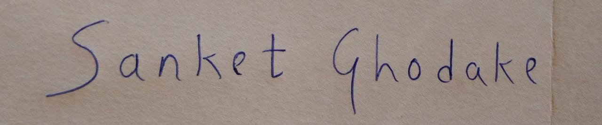

 # handwritten-character-recognition
**Handwriting recognition** (**HWR**), also known as **handwritten text recognition** (**HTR**), is the ability of a computer to receive and interpret intelligible [handwritten](https://en.wikipedia.org/wiki/Handwriting "Handwriting") input from sources such as [paper](https://en.wikipedia.org/wiki/Paper "Paper") documents, [photographs](https://en.wikipedia.org/wiki/Photograph "Photograph"), [touch-screens](https://en.wikipedia.org/wiki/Touch-screen "Touch-screen") and other devices.
[Wikipedia](https://en.wikipedia.org/wiki/Handwriting_recognition#:~:text=Handwriting%20recognition%20(HWR)%2C%20also%20known%20as%20handwritten%20text%20recognition%20(HTR)%2C%20is%20the%20ability%20of%20a%20computer%20to%20receive%20and%20interpret%20intelligible%20handwritten%20input%20from%20sources%20such%20as%20paper%20documents%2C%20photographs%2C%20touch%2Dscreens%20and%20other%20devices.)

Handwritten Text Recognition (HTR) system implemented with TensorFlow (TF) and trained on the [MNIST](https://www.tensorflow.org/datasets/catalog/mnist) and [EMNIST](https://www.tensorflow.org/datasets/catalog/emnist) off-line handwritten English digits and characters dataset.(Version - TF datasets) 
The system takes **images of single words or text lines (multiple words) as input (horizontal aligned)** and **outputs the recognized text**.

## Working of system 

*Block Diagram*

Run [demo](./doc/cropped_and_warp-perspective.jpeg) on [Colab Notebook](handwritten_character_recognition.ipynb)

### Cropping image 
At first input image is cropped using **contour detection** and cropped quadrilateral shape is aligned into the original rectangle shape by using the **warp-perspective** algorithm of *OpenCV*. The cropping part is not implemented in *colab*, hence it assumes the image is well aligned and cropped as shown below.

*Input image*

*Cropped and deskew image, horizontal text*

### Convert to binary image 
Convert an image into a binary image by applying a **threshold** value. 
Manually select threshold value from a histogram of an image.  **Opening and closing morphological operations** are performed to incerease readiability and reduce noise.

*Histogram*

*Binary image*

### Segmentation

The line is segmented into words first. Then each word is segmented into individual characters. [Vertical Histogram Projection](https://towardsdatascience.com/segmentation-in-ocr-10de176cf373#:~:text=Vertical%20Histogram%20Projection%3A%20In%20this%20method%2C%20we%20count%20the%20No.of%20foreground%20pixels%20along%20the%20image%20columns.%20The%20resultant%20array%20is%20of%20the%20size%20equal%20to%20No.of%20columns%20in%20the%20image%20(Width%20of%20the%20image).) algorithm used for extracting characters from word. [Tesseract (pytesseract)](https://tesseract-ocr.github.io/)is used to extract words from a line. Segmentation supports distinct characters, if two characters are joined or a broken character, then the segmentation results are not accurate.

*Word segmentation into characters*

### Prediction 
Predicting each character image on pre-trained models. Choose a model according to text type.

*Predicted output*

### HCR results 

   
  

*HCR results*

### Model training
[Models](./models) are trained on  [MNIST](https://www.tensorflow.org/datasets/catalog/mnist) and [EMNIST](https://www.tensorflow.org/datasets/catalog/emnist) datasets. This datasets have gray scale images (28X28 pixels). Pre-trained models are trained on different custom datasets. 
Binary model is trained on binary images of above datasets.
Different trained models are of types:
1. Alphanumeric Merged Classes #Default
2. Capital Letters 
3. Digits 
4. Letters (small +capital merged classes)
5. Digits+Capital Letters 

## References
1. [Build a Handwritten Text Recognition System using TensorFlow](https://towardsdatascience.com/2326a3487cd5)
2.  [Handwritten Text Recognition (HTR) system implemented with TensorFlow](https://github.com/githubharald/SimpleHTR)
3.  [Optical Character Recognition via Deep Learning ,Coonor Meany ,Matias Arola ,Stanford University CS230](https://cs230.stanford.edu/files_winter_2018/projects/6910235.pdf)
4.  [An Overview of the Tesseract OCR ,Engine Ray Smith,Google Inc.](https://static.googleusercontent.com/media/research.google.com/en//pubs/archive/33418.pdf)
5. [A Survey of Handwritten Character Recognition with
MNIST and EMNIST](https://www.researchgate.net/publication/334957576_A_Survey_of_Handwritten_Character_Recognition_with_MNIST_and_EMNIST)
